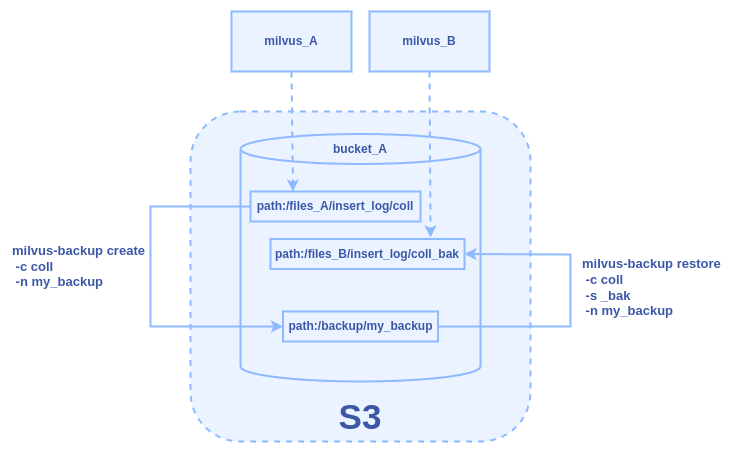

# Migrate Between Instances in One Bucket (Different Root Paths)

This topic details the process of backing up a collection from one
Milvus instance and restoring it to another while using a shared bucket
for object storage, with distinct root paths for each instance.

## Overview

The diagram below illustrates the backup and restore process using a
shared bucket.



Assume we have Milvus instances, `milvus_A` and `milvus_B`, both utilizing
the default MinIO storage engine for object storage. These instances
share the same bucket, `bucket_A`, but store their data in different root
paths: `files_A` for `milvus_A` and files_B for `milvus_B`. In this example,
our goal is to complete the following tasks:

1. Create a backup (my_backup) for collection coll that is stored under the
`files_A` path for `milvus_A`.

2. Restore from the backup and store it to files_B for `milvus_B`.

## Prerequisites

- Ensure the **milvus-backup** tool is installed.

- Familiarize yourself with configuring Milvus object storage settings.
For details, refer to [Object
Storage](https://milvus.io/docs/deploy_s3.md).

## Back up a collection from `milvus_A`

### Step 1: Prepare configuration

Go to the directory of the milvus-backup project and create a directory
named configs:

```shell
mkdir configs
cd configs
```

Download the backup config file backup.yaml:

```shell
wget https://raw.githubusercontent.com/zilliztech/milvus-backup/main/configs/backup.yaml
```

The file structure looks like this:

```
├── configs
│   └── backup.yaml
├── milvus-backup
└── README.md
```

### Step 2: Edit configuration file

Modify the backup.yaml file to set the appropriate configurations for
`milvus_A`:

- Connection configs
  
  ```yaml
  # milvus proxy address, compatible to milvus.yaml
  milvus:
    address: milvus_A
    port: 19530
    authorizationEnabled: false
    # tls mode values [0, 1, 2]
    # 0 is close, 1 is one-way authentication, 2 is two-way authentication.
    tlsMode: 0
    user: "root"
    password: "Milvus"
  ```

  - `milvus.address`: IP address or hostname of the `milvus_A` server.

  - `milvus.port`: TCP port on which Milvus server is listening (default
19530).

- Storage configs (MinIO/S3 settings)

  ```yaml
  # Related configuration of minio, which is responsible for data persistence for Milvus.
  minio:
    # cloudProvider: "minio" # deprecated use storageType instead
    storageType: "minio" # support storage type: local, minio, s3, aws, gcp, ali(aliyun), azure, tc(tencent)
    
    address: milvus_A # Address of MinIO/S3
    port: 9000   # Port of MinIO/S3
    accessKeyID: minioadmin  # accessKeyID of MinIO/S3
    secretAccessKey: minioadmin # MinIO/S3 encryption string
    useSSL: false # Access to MinIO/S3 with SSL
    useIAM: false
    iamEndpoint: ""
    
    bucketName: "bucket_A" # Milvus Bucket name in MinIO/S3, make it the same as your milvus instance
    rootPath: "files_A" # Milvus storage root path in MinIO/S3, make it the same as your milvus instance

    # only for azure
    backupAccessKeyID: minioadmin  # accessKeyID of MinIO/S3
    backupSecretAccessKey: minioadmin # MinIO/S3 encryption string
    
    backupBucketName: "bucket_A" # Bucket name to store backup data. Backup data will store to backupBucketName/backupRootPath
    backupRootPath: "backup" # Rootpath to store backup data. Backup data will store to backupBucketName/backupRootPath
  ```

  - `minio.bucketName`: Name of the bucket used for `milvus_A` storage. In this
  example, set to `bucket_A`.

  - `minio.rootPath`: Root path within the bucket where data from `milvus_A` is stored. In this example, set to `files_A`.

  - `minio.backupBucketName`: Name of the bucket used for storage. In this
  example, `milvus_A` and `milvus_B` share the bucket. Therefore, set to
  `bucket_A`.

  - `minio.backupRootPath`: Root path within the bucket designated for storing backup files in `milvus_B`. In this example, use a different path from `milvus_A`. Therefore, set to `backup`.

### Step 3: Create backup

Once `backup.yaml` is saved, create a backup named my_backup:

```shell
./milvus-backup create -c coll -n my_backup
```

This command creates the backup `bucket_A/backup/my_backup` in object
storage for the collection `coll`.

## Restore the backup to `milvus_B`

### Step 1: Configure restoration settings

Repeat step
2 to modify configs for restoration to `milvus_B`, ensuring `minio.bucketName` is set to `bucket_A` and `minio.rootPath` to `files_B` to distinguish storage locations between the two instances.

Here\'s a sample configuration:

```yaml
...
# milvus proxy address, compatible to milvus.yaml
milvus:
  address: milvus_B
  port: 19530
  authorizationEnabled: false
  # tls mode values [0, 1, 2]
  # 0 is close, 1 is one-way authentication, 2 is two-way authentication.
  tlsMode: 0
  user: "root"
  password: "Milvus"
  
# Related configuration of minio, which is responsible for data persistence for Milvus.
minio:
  # cloudProvider: "minio" # deprecated use storageType instead
  storageType: "minio" # support storage type: local, minio, s3, aws, gcp, ali(aliyun), azure, tc(tencent)
  
  address: milvus_B # Address of MinIO/S3
  port: 9000   # Port of MinIO/S3
  accessKeyID: minioadmin  # accessKeyID of MinIO/S3
  secretAccessKey: minioadmin # MinIO/S3 encryption string
  useSSL: false # Access to MinIO/S3 with SSL
  useIAM: false
  iamEndpoint: ""
  
  bucketName: "bucket_A" # Milvus Bucket name in MinIO/S3, make it the same as your milvus instance
  rootPath: "files_B" # Milvus storage root path in MinIO/S3, make it the same as your milvus instance
  ...
```

### Step 2: Restore backup

Restore the backup to `milvus_B`:

```shell
./milvus-backup restore -c coll -n my_backup -s _bak
```

This command restores the backup into a new collection named `coll_bak` in `milvus_B`, with data stored in `bucket_A/files_B/insert_log/[ID of new collection]`.
